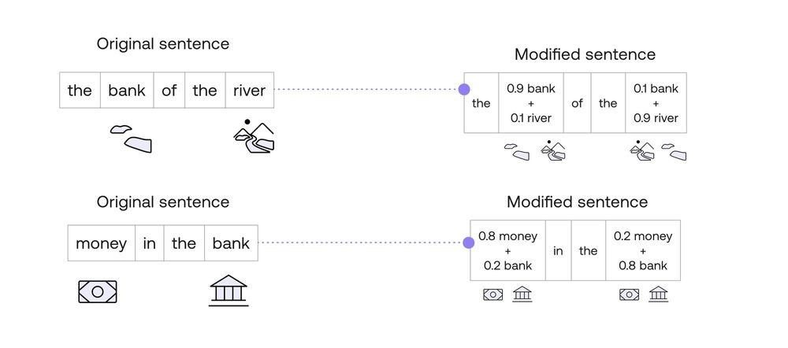
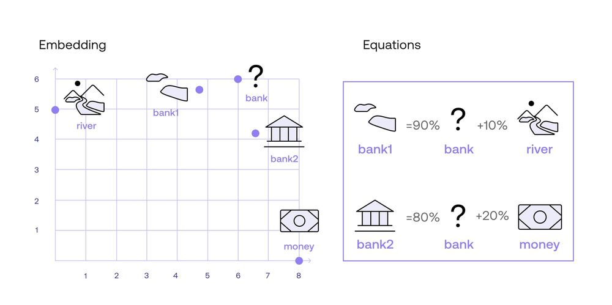
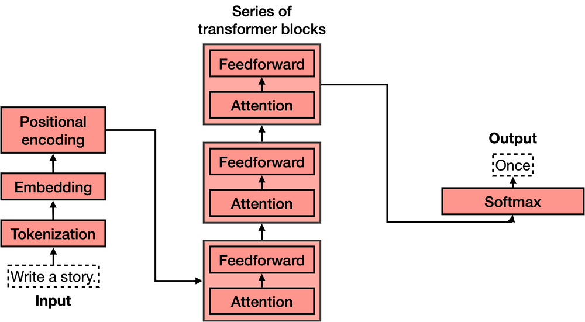
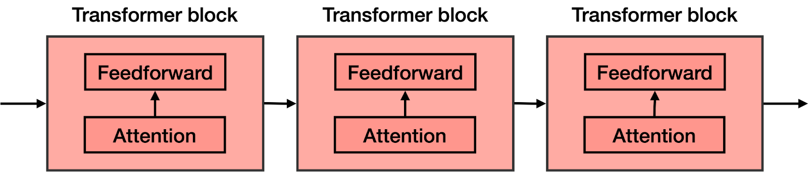
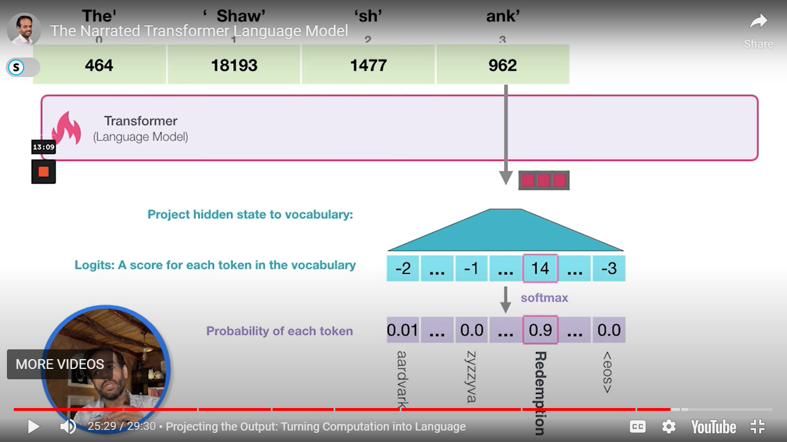

# LLMS

Large language models are machine learning models designed to process and analyze text. They are trained on massive amounts of data, and they learn the patterns in the language, allowing them to generate human-like responses to any query we give them.

Large language models are normally based on very large, deep neural networks. Their numerous applications include chatbots, language translation, and text summarization among many others.

## Embedding

How can we turn words and sentences into numbers

### Word Embedding

Following are the properties

1. **Similarity**: - Words that are similar should correspond to points that are close by

2. **Analogy & Word Math** - it captures analogy like what puppy is to dog similarlu calf is to cow and then math is that they age in same way

### Sentence embeddings

word embeddings seem to be pretty useful, but in reality, human language is much more complicate there are sturctures and sentences

How about the sums of scores of all the words? However, the sentence “I am no good” will also correspond to “No, I am good!"

Therefore, we need better embeddings that take into account the order of the words, the semantics of the language

This is where sentence embeddings come into play it associates every sentence with a vector full of numbers,

### Similarity Between Text

1. Dot Product - similar movies have high dot product for hihgh similarity

2. cosine distance - similar movies have high cosine

## Attention Mechanism

### attention

words that have more than one definition, it assigns the same vector to all the definitions What if you want to use this word in different contexts?

One Word, Multiple Meanings

Sentence 1: The bank of the river.
Sentence 2: Money in the bank.

In these two sentences, the computer now knows a little more about the context of the word “bank”, as the word has been split into two distinct ones. One whose definition is closer to “river”, and another one whose definition is closer to “money”. That, in short, is how attention mechanisms work

But how does it understand that we must focus on river or money only it is like gravity the nearer the word is to our target, the more it gets pulled to nearest word

### Attention Mechanism

<<<<<<< HEAD

## Transformer Model 
It has ability to carry context which have been real challenge

=======
instead of using one embedding, we create multiple embeddings using a linear transformation of those vertices and take out the best embedding

.png>)
.png>)
.png>)
.png>)
Distance is nothing but similarity between them
.png>) 
.png>) 
.png>) 
.png>) 
Everything in real world is done using scaled dot product

.png>) 
.png>) 
.png>) 
.png>) 
.png>) 
.png>) 
.png>) 
.png>)

`We take a line from apple to orange then I move apple towards orange for 43. Because apple is 43% of orange in our equation`

### Keys Values and Queries as linear Transformations
.png>) 
.png>) 
`Queries:  the word (or token) for which we want to find relevant information from other words. here fruit`

`Keys:  These represent the other words (or tokens) that the model will use to provide relevant information. here phone`

the above can be used interchangebly

`Values: Values are the actual information that will be retrieved based on the similarity between the query and the keys.` after applying values matrix to the best linearly transformed ./images/image it helps us find next wordz

.png>)
.png>) 
.png>)
`keys and queries matrix multiplication: Used to find the linear transformation. `

.png>) 
.png>) 
.png>) 
.png>) 
.png>) 
.png>) 
.png>) 
.png>) 

Q(trans(K))/root(dist) - scaled dot product
.png>) 
.png>) 
.png>) 
.png>) 
.png>) 
.png>) 
### Transformer Model

neural netwrok might just predict new word but it doesnt understand context

.png>) 
.png>) 
.png>) 
.png>) 
.png>) 
.png>) 
.png>)

How to convert vectors to language

